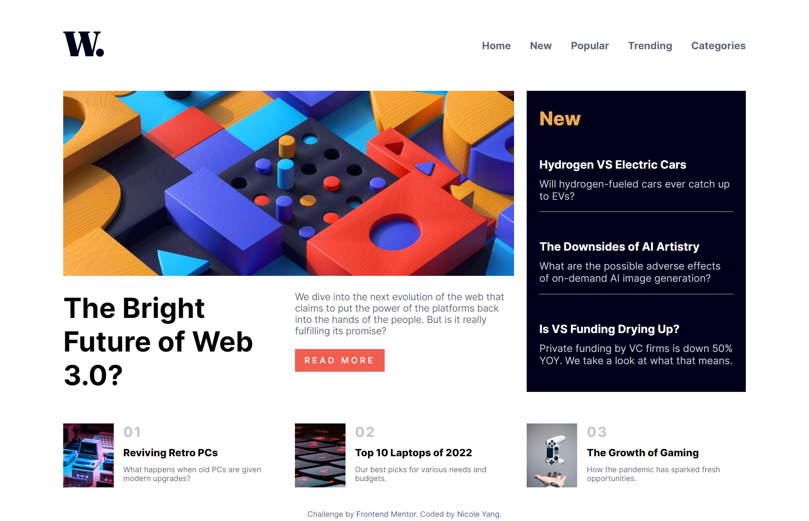

# Frontend Mentor - News homepage solution

This is a solution to the [News homepage challenge on Frontend Mentor](https://www.frontendmentor.io/challenges/news-homepage-H6SWTa1MFl). Frontend Mentor challenges help you improve your coding skills by building realistic projects. 

## Table of contents

- [Overview](#overview)
  - [The challenge](#the-challenge)
  - [Screenshot](#screenshot)
  - [Links](#links)
- [My process](#my-process)
  - [Built with](#built-with)
- [Author](#author)

## Overview

### The challenge

Users should be able to:

- View the optimal layout for the interface depending on their device's screen size
- See hover and focus states for all interactive elements on the page

### Screenshot

    <h5>Desktop: </h5>
    

    <h5>Mobile: </h5>
    

### Links

- Solution URL: [https://www.frontendmentor.io/challenges/news-homepage-H6SWTa1MFl/hub](https://www.frontendmentor.io/challenges/news-homepage-H6SWTa1MFl/hub)
- Live Site URL: [https://nicoleyry-news-homepage.netlify.app/](https://nicoleyry-news-homepage.netlify.app/)

## My process

### Built with

- Semantic HTML5 markup
- CSS custom properties
- Flexbox
- CSS Grid
- Mobile-first workflow
- [React](https://reactjs.org/) - JS library
- [SASS](https://sass-lang.com/) - For styles

## Author

- Website - [Nicole Yang](https://www.nicoleyry.com/)
- Frontend Mentor - [@nicoleyry](https://www.frontendmentor.io/profile/nicoleyry)
- Twitter - [@nicoleyry](https://twitter.com/nicoleyry)